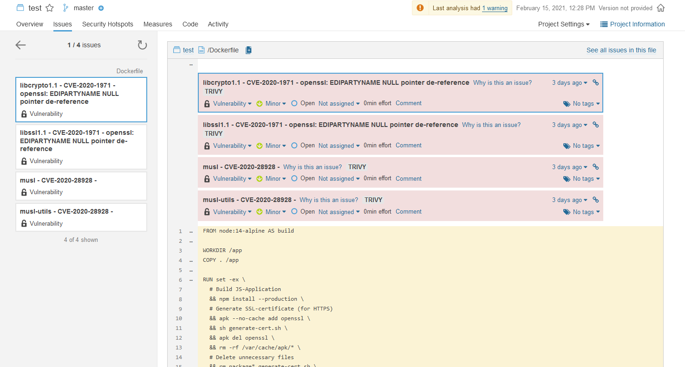

### What is this

A custom template that Trivy can use, to generate a Sonarqube friendly output.  It uses [Sonarqube Generic Issue Import Format](https://docs.sonarqube.org/latest/analysis/generic-issue/). 

### Instructions

Start the Sonarqube server locally.

    docker-compose up

Do the first time setup in Sonarqube - reset your admin password, create a project called test, generate a key for that project. 

Create a **normal Trivy HTML output**:

```
docker run --rm -v /var/run/docker.sock:/var/run/docker.sock \
                -v ${PWD}/trivy-cache/:/root/.cache/ \
                -v ${PWD}/trivy-output:/output \
                aquasec/trivy image --exit-code 1 --no-progress \
                --format template --template "@contrib/html.tpl" -o /output/report.html \
                mendhak/http-https-echo:15
```


Now create a **custom Sonarqube JSON output**, using the custom.tpl as a template:

```
docker run --rm -v /var/run/docker.sock:/var/run/docker.sock \
                -v ${PWD}/trivy-cache/:/root/.cache/ \
                -v ${PWD}/custom.tpl:/input/custom.tpl \
                -v ${PWD}/trivy-output:/output aquasec/trivy \
                image --exit-code 1 --no-progress \
                --format template --template "@/input/custom.tpl" \
                -o /output/report.json \
                mendhak/http-https-echo:15
```

Finally, **send the generated report.json** to Sonarqube using Sonar Scanner CLI:

```
docker run --rm \
           -e SONAR_HOST_URL=http://host.docker.internal:9000 \
           -e SONAR_LOGIN=0e66a8b9d4add3e56465debd0dca77fe41159fb8 \
           -v ${PWD}:/usr/src sonarsource/sonar-scanner-cli \
           -Dsonar.projectKey=test \
           -Dsonar.externalIssuesReportPaths=/usr/src/trivy-output/report.json 
```


### Screenshot

